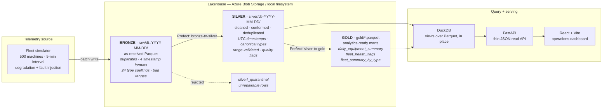

# Fleet Telemetry Data Platform

A bronze / silver / gold lakehouse for construction and mining equipment telemetry —
500 simulated machines emitting sensor readings every five minutes, landed as raw
Parquet, cleaned and conformed, aggregated into analytics-ready marts, queried by
DuckDB, and surfaced through a FastAPI + React operations dashboard.

The pipeline is the point. The dashboard is how you look at it.

---

## What this project demonstrates

| Concept | Where it lives here |
|---|---|
| **Data engineering** — ingestion and transformation pipelines | A stateful telemetry generator landing raw Parquet, then Prefect flows that clean, deduplicate, validate and aggregate it. Incremental by partition, idempotent on rerun. |
| **Data warehousing** — an OLAP layer separated from any transactional store | DuckDB queries the Parquet files *in place*. Nothing is loaded into the engine's own storage; the lake is the storage layer and the query engine is stateless and disposable. |
| **Big data patterns** — columnar storage, partitioning, batch processing | Parquet with zstd compression throughout, Hive-style `dt=` partitioning on the time-series layers, partition pruning and predicate pushdown at query time, batch windows sized so memory stays flat as history grows. |
| **Azure cloud-native tooling** | Blob Storage as the lake, Container Apps **Jobs** for the scheduled ETL, a scale-to-zero Container App for the API, connection strings injected as Container Apps secrets. |

Every layer runs locally against the filesystem first. Moving to Azure changes one
environment variable.

---

## Architecture



Deployed shape on Azure:

```
Container Apps JOB  (cron: hourly, bills per execution)  ──▶  bronze → silver → gold
Container App       (min-replicas 0, scale to zero)      ──▶  FastAPI read API
Vercel              (static, free)                       ──▶  React dashboard
Blob Storage        (Standard_LRS, hot)                  ──▶  the lake itself
```

---

## Why three layers

The layers exist to separate three responsibilities that pull against each other.
Collapsing them is the mistake this architecture is built to avoid.

### Bronze — raw fidelity

Bronze stores what the telematics gateways actually sent, **including everything wrong
with it**. In this project the raw feed genuinely contains:

- the same reading delivered twice, sometimes re-sent in a *later* batch under a
  different ingest id (at-least-once delivery);
- four different timestamp encodings — `2026-08-19T09:55:00Z`,
  `2026-08-19T17:55:00+08:00`, `2026-08-19 09:55:00` with the timezone marker dropped,
  and epoch milliseconds as a string;
- 24 spellings of four equipment types, because different vendors label them
  differently and nobody normalises before the lake;
- physically impossible sensor values — 128% fuel, −273 °C coolant, negative oil
  pressure — and GPS fixes at exactly (0, 0);
- missing readings where a gateway was offline.

None of that is cleaned here, and that is the whole point. If you clean on ingest you
can never reprocess with a corrected rule, you cannot audit what the sensor originally
claimed, and you have destroyed the evidence that the fleet has a data-quality problem
at all. Raw is immutable and replayable; everything downstream is derivable from it.

`timestamp` is deliberately stored as a **string** in bronze. Parsing it at ingest would
force all four encodings into one type and silently erase the inconsistency.

### Silver — cleaned and conformed

Silver is where the raw feed becomes trustworthy, and where every repair is recorded
rather than performed invisibly:

- all four timestamp encodings parse to a single UTC `event_time`;
- the 24 type spellings collapse to four canonical values, so a `GROUP BY equipment_type`
  downstream returns four rows instead of twenty-four;
- out-of-range values are **nulled and flagged**, not dropped — one failed sensor should
  not discard the five good sensors sharing its row;
- duplicates collapse on the business key `(equipment_id, event_time)`, keeping the
  earliest ingest so replays are idempotent;
- rows that cannot be repaired at all go to `_quarantine/` with a reason, so a shrinking
  row count is always explainable instead of mysterious.

Every row carries a `quality_flags` audit trail of exactly which rules fired on it. That
is what makes the cleaning defensible in a review rather than magical.

### Gold — analytics-ready

Gold answers business questions, not sensor questions. Three marts:

- **`daily_equipment_summary`** — one row per machine per day: temperature statistics,
  oil pressure, operating hours off the engine hour meter, fuel consumed, fault counts.
- **`fleet_health_flags`** — machines currently worth a maintenance planner's attention,
  from explainable rules over a trailing window (temperature trending up, oil pressure
  falling, fault codes clustering, telemetry gone stale). Rule-based on purpose: a
  planner has to be able to ask "why is this machine on the list" and get a sentence
  back, which a gradient-boosted model does not provide.
- **`fleet_summary_by_type`** — the fleet rollup the dashboard's summary cards read.

Gold is **not** date-partitioned. Partitioning exists to let a query skip files; these
tables are small, already aggregated, and read whole on every dashboard load, so
partitioning them would add path complexity and buy nothing.

---

## Quickstart

Nothing here needs an Azure account. The entire pipeline runs against the local
filesystem first — that is deliberate, so the logic is verified before anything bills.

```bash
make install          # .venv on python3.12 + dependencies + .env from .env.example
make generate         # simulate 3 days of raw telemetry into data/raw/
make etl              # bronze -> silver -> gold (exactly what the Azure Job runs)
make queries          # run the example analytical SQL against the lake
make test             # the full test suite
```

Then, in two terminals:

```bash
make backend          # FastAPI on http://localhost:8000
make frontend         # React dashboard on http://localhost:5173
```

Switching to Azure Blob is one environment variable — see
[docs/DEPLOYMENT.md](docs/DEPLOYMENT.md):

```bash
LAKE_BACKEND=azure
AZURE_STORAGE_CONNECTION_STRING=...   # a Container Apps secret in production
AZURE_BLOB_CONTAINER=fleet-lake
```

---

## Numbers from a representative run

Three simulated days, 500 machines, one reading per machine per five minutes.
Everything below is measured from an actual `make generate && make etl`, not estimated.

| Layer | Rows | Files | Size | Notes |
|---|---:|---:|---:|---|
| **bronze** `raw/` | 429,290 | 77 | 12.2 MB | 4 date partitions; 24 `equipment_type` spellings, 4 timestamp encodings |
| **silver** `silver/` | 426,760 | 4 | 7.8 MB | 2,530 duplicate business keys removed — the row count reconciles exactly |
| **gold** `gold/` | 2,000 / 23 / 4 | 3 |  172 KB | daily summary / health flags / type rollup |

The bronze→silver difference is fully accounted for: 429,290 − 2,530 duplicates =
426,760. Of those duplicates, 821 were cross-batch resends that a naive
`drop_duplicates()` over all columns would have missed entirely.

Silver's `quality_flags` audit trail for the same run: 21,149 rows where the
gateway had dropped its timezone marker (`assumed_utc`), 324 GPS fixes at null
island, and ~900 sensor values nulled for being physically impossible.

**What the health rules actually achieve.** Cross-checked against the failures the
generator planted (ground truth the rules never see):

| | value |
|---|---|
| machines flagged | 23 of 500 (4.6%) — 15 critical, 8 warning |
| precision vs. planted failures | **100%** — every flagged machine is genuinely degrading |
| recall vs. planted failures | 53.5% |

The missed half is the honest part: those machines are early in their degradation
ramp and have zero or one fault code in the window. There is nothing in the data
yet to detect. A rule-based system cannot find a failure that has not begun to
manifest, and pretending otherwise would mean lowering thresholds until the alert
list filled with noise.

---

## Repository layout

```
pipeline/
  config.py               env-var-only configuration; no hardcoded paths anywhere
  storage.py              one interface, two backends: local filesystem and Azure Blob
  schemas.py              explicit Parquet schemas — the contract for every layer
  generator/              the bronze telemetry simulator
    profiles.py           equipment classes, job sites, J1939 fault-code catalogue
    simulator.py          vectorised fleet physics + degradation + dirt injection
    run_generator.py      CLI: land raw batches in the lake
  transforms/             pure DataFrame-in / DataFrame-out logic (no I/O, no Prefect)
    cleaning.py           bronze -> silver rules
    aggregations.py       silver -> gold rules
  flows/                  Prefect orchestration wrapping the transforms
    silver_flow.py        bronze-to-silver
    gold_flow.py          silver-to-gold
    etl_flow.py           both, in order — the container entrypoint
  warehouse/              the DuckDB OLAP layer
    session.py            registers views over Parquet in place
    queries.sql           documented example analytical queries
    run_queries.py        CLI runner / smoke test
backend/                  FastAPI read API over the gold layer
frontend/                 React + Vite dashboard
tests/                    unit tests per layer + cross-layer integration tests
docs/                     DEPLOYMENT.md · COST.md · WAREHOUSE.md
```

The split between `transforms/` and `flows/` is intentional: all the business logic is
pure functions over DataFrames, so it is unit-testable without Prefect, without Azure and
without a filesystem. The flows only wire storage to those functions.

---

## Testing

```bash
make test
```

The suite asserts two properties that pull in opposite directions, because losing either
one makes the whole project meaningless:

- the data must be **realistic** — monotonic hour meters, correlated sensors, fault codes
  that cluster before a failure — otherwise the gold layer detects nothing genuine;
- the data must be **dirty** — otherwise the silver layer is a no-op and the layered
  architecture is decoration.

The integration tests pin the *seams*: silver's row count reconciles against bronze,
reruns are byte-identical, gold's fuel consumption never goes negative across a refuel,
and the machines flagged by the health rules are cross-checked against the failures the
generator actually planted.

---

## Deployment

See **[docs/DEPLOYMENT.md](docs/DEPLOYMENT.md)** for the full `az` runbook and
**[docs/COST.md](docs/COST.md)** for the free-tier budget.

The load-bearing decision: the ETL deploys as an Azure Container Apps **Job** on a cron
trigger, not as a Container App. A Job bills only for the seconds an execution actually
runs; a long-running app with `--min-replicas 1` bills continuously whether or not it is
doing anything. For an hourly batch that finishes in a couple of minutes, that is the
difference between fitting comfortably in the free grant and not.

---

## Design decisions worth defending

**Custom simulator rather than `faker`.** Faker produces independent random values.
Telemetry is the opposite: a machine's coolant temperature at 06:05 is mostly determined
by what it was at 06:00. Without that continuity there is no trend to detect, so the
analytics layer would be detecting noise and the project would prove nothing.

**Bronze is dirty on purpose.** Roughly 9% of the simulated fleet is placed on a failure
trajectory — a mode is chosen, a failure time scheduled, and a severity ramp runs for
18–40 hours beforehand, pushing the relevant sensor off nominal while fault codes cluster
super-linearly toward the event. Machines still mid-ramp when the data ends are exactly
the population `fleet_health_flags` should surface.

**Parquet, not CSV or JSON.** These are analytical scans over a narrow slice of columns.
Columnar layout means a query reading `coolant_temp_c` never touches the GPS columns;
row formats have to read everything. Compression is far better on columnar data too,
which matters directly when the storage is billed by the gigabyte.

**DuckDB over Parquet in place, not a loaded database.** The lake is the storage layer.
DuckDB is a stateless query engine pointed at it, so there is no second copy to keep in
sync, no load step to schedule, and no stateful database to pay for while idle. Details
in [docs/WAREHOUSE.md](docs/WAREHOUSE.md).

**One storage interface, two backends.** Every layer addresses data by a relative key.
Locally that key is a path under `data/`; on Azure it is a blob name in a container. The
layout on disk is therefore byte-for-byte the layout in Blob Storage, which makes local
development a genuine rehearsal of the deployment rather than an approximation.

**Under load is not the same as up to temperature.** The most instructive bug in
this project, and the one worth walking through in an interview. `is_under_load`
turns true the moment oil pressure rises, but coolant lags it by roughly three
15-minute thermal time constants. Computing temperature statistics over every
under-load reading therefore averages in the warm-up ramp: the fleet's mean
"operating" temperature read 74 °C against a nominal band of 85–95 °C, and a
least-squares trend fitted through a machine that cold-started inside the window
reported 2–4 °C/hour of *warm-up* as though it were degradation.

That single effect produced 56 of 102 flagged machines at 3.6% precision — against
a base rate of 8.6%, so the rule was worse than flagging at random. Excluding the
first nine readings of each duty cycle fixed it: the fleet averages snapped back to
91.9 / 87.9 / 89.8 / 85.0 °C, within 0.2 °C of each machine class's true nominal,
and the trend rule went to 100% precision. The related fix was moving the
high-temperature rules off `max()` and onto the 95th percentile — one 120 °C sample
is a CAN glitch, twelve of them is an engine running hot.

**Rule-based health flags, not ML.** The thresholds are named constants with a stated
justification each, and every flagged machine carries the list of rules that fired. A
maintenance planner can act on "coolant trending up 0.4 °C/hour with four repeat fault
codes". They cannot act on "0.83".
